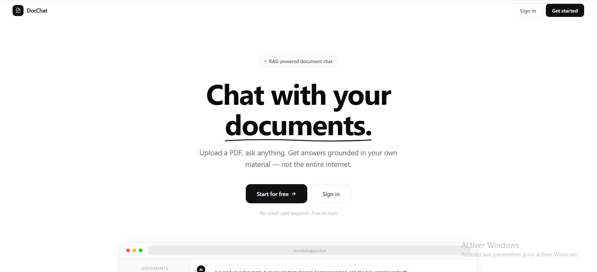
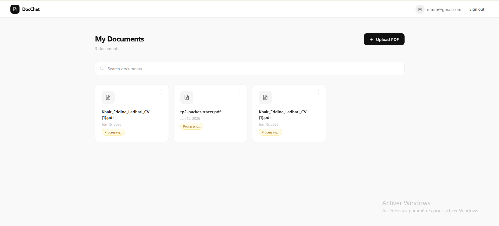
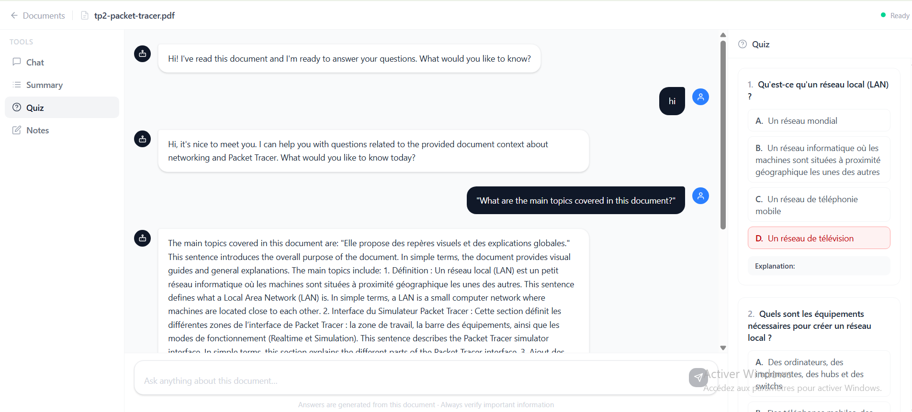

# 🧠 Learning AI Assistant

> An AI-powered document chat application inspired by NotebookLM — upload your documents and have intelligent conversations with them.


---

## 📸 Screenshots

### Landing Page


### My Documents


### Chat + Quiz


---

## ✨ Features

- 📄 **Document Upload** — Upload PDF files and process them for AI-powered chat
- 💬 **Chat with Documents** — Ask questions and get answers grounded in your document content
- 🧪 **Quiz Generation** — Auto-generate multiple choice quizzes from document content
- 📝 **Notes** — Take and manage notes while studying your documents
- 🔐 **Authentication** — JWT-based auth with protected routes and role-based access
- 🌐 **RAG Pipeline** — Retrieval-Augmented Generation using Pinecone vector search + Groq LLaMA

---

## 🏗️ Architecture

```
LEARNING-AI-ASSISTANT/
├── frontend/               # React + Vite + Tailwind
│   └── src/
│       ├── components/     # Navbar, shared UI
│       ├── context/        # AuthContext
│       ├── pages/          # LandingPage, ChatPage, HomePage, Profile...
│       └── privacy/        # PrivateRouter, PrivateRouterAdmin
│
├── server/                 # Node.js + Express backend
│   ├── config/             # MongoDB connection
│   ├── controllers/        # auth, chat, document, notes, quiz
│   ├── middleware/         # passport, roles, upload (Multer)
│   ├── models/             # User, Document, Chat, Note, Ask
│   ├── routes/             # API routes
│   └── python/             # Python FastAPI RAG service
│       ├── main.py
│       └── requirements.txt
```

---

## 🔧 Tech Stack

| Layer | Technology |
|---|---|
| Frontend | React, Vite, Tailwind CSS |
| Backend | Node.js, Express.js |
| Database | MongoDB, Mongoose |
| Auth | JWT, Passport.js |
| File Upload | Multer |
| RAG Service | Python, FastAPI |
| Embeddings | Sentence Transformers / Pinecone Inference |
| Vector DB | Pinecone |
| LLM | Groq (LLaMA 3.3 70B) |
| Deployment | Render |

---

## 🚀 Getting Started

### Prerequisites

- Node.js v18+
- Python 3.10+
- MongoDB Atlas account
- Pinecone account
- Groq API key

### 1. Clone the repository

```bash
git clone https://github.com/khair-eddine-ladhari/learning-ai-assistant.git
cd learning-ai-assistant
```

### 2. Setup the frontend

```bash
cd frontend
npm install
npm run dev
```

Create a `.env` file in `frontend/`:
```env
VITE_API_URL=http://localhost:5000
```

### 3. Setup the Node backend

```bash
cd server
npm install
node server.js
```

Create a `.env` file in `server/`:
```env
MONGO_URI=your_mongodb_uri
JWT_SECRET=your_jwt_secret
PYTHON_SERVICE_URL=http://localhost:8000
```

### 4. Setup the Python RAG service

```bash
cd server/python
pip install -r requirements.txt
uvicorn main:app --host 0.0.0.0 --port 8000
```

Create a `.env` file in `server/python/`:
```env
GROQ_API_KEY=your_groq_api_key
PINECONE_API_KEY=your_pinecone_api_key
PINECONE_INDEX_NAME=your_index_name
```

---

## 🌍 Deployment

The project is deployed on **Render** as two separate services:

| Service | Root Dir | Type |
|---|---|---|
| Node API | `server` | Web Service (Node) |
| Python RAG | `server/python` | Web Service (Python) |

---

## 👤 Author

**Khair Eddine Ladhari**
- GitHub: [@khair-eddine-ladhari](https://github.com/khair-eddine-ladhari)

---

## 📄 License

This project is for educational and portfolio purposes.
